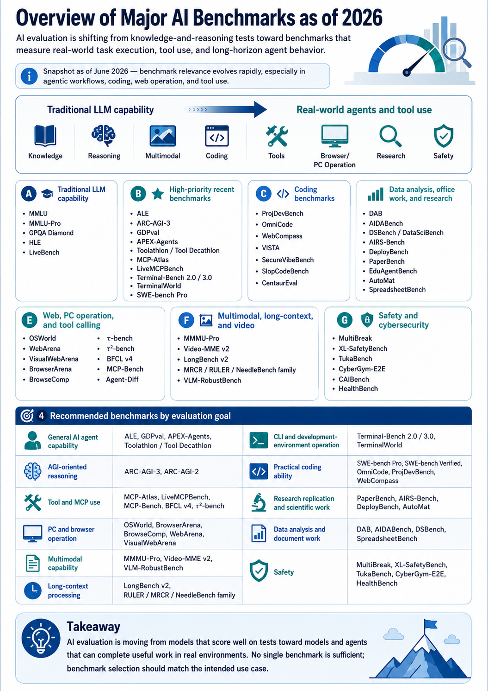

# AI Benchmark List 2026

[](#)
[](#)
[](#)

A trilingual, GitHub-ready filing package for major AI evaluation benchmarks as of **June 2026**.

AI evaluation is shifting from static knowledge and reasoning tests toward benchmarks that measure **real-world task execution**, **tool use**, **coding**, **browser/PC operation**, **research workflows**, **safety**, and **long-horizon agent behavior**.

> [!NOTE]
> Benchmark relevance changes quickly, especially in agentic workflows, coding, web operation, and tool use. This repository should be treated as a snapshot, not a fixed ranking.

## Quick links

| Language | File |
|---|---|
| English | [`docs/benchmark-list.en.md`](docs/benchmark-list.en.md) |
| 中文（简体） | [`docs/benchmark-list.zh-CN.md`](docs/benchmark-list.zh-CN.md) |
| 日本語 | [`docs/benchmark-list.ja.md`](docs/benchmark-list.ja.md) |

## Visual overview



## Scope

This repository currently covers **58 benchmark entries** across the following evaluation areas:

- Traditional LLM capability
- AGI-oriented reasoning
- Practical AI agents
- Tool use and MCP
- CLI and software engineering
- Data, office work, and research
- Web and PC operation
- Multimodal, long-context, and video
- Safety, cybersecurity, and healthcare

## Recommended benchmark bundles

| Evaluation goal | Recommended benchmarks |
|---|---|
| General AI agent capability | ALE, GDPval, APEX-Agents, Toolathlon / Tool Decathlon |
| AGI-oriented reasoning | ARC-AGI-3, ARC-AGI-2 |
| Tool and MCP use | MCP-Atlas, LiveMCPBench, MCP-Bench, BFCL v4, τ²-bench |
| PC and browser operation | OSWorld, BrowserArena, BrowseComp, WebArena, VisualWebArena |
| CLI and development-environment operation | Terminal-Bench 2.0 / 3.0, TerminalWorld |
| Practical coding ability | SWE-bench Pro, SWE-bench Verified, OmniCode, ProjDevBench, WebCompass |
| Research replication and scientific work | PaperBench, AIRS-Bench, DeployBench, AutoMat |
| Data analysis and document work | DAB, AIDABench, DSBench, SpreadsheetBench |
| Multimodal capability | MMMU-Pro, Video-MME v2, VLM-RobustBench |
| Long-context processing | LongBench v2, RULER / MRCR / NeedleBench family |
| Safety | MultiBreak, XL-SafetyBench, TukaBench, CyberGym-E2E, HealthBench |

## Repository structure

```text
.
├── README.md
├── CONTRIBUTING.md
├── .gitignore
├── assets/
│   └── ai-benchmark-overview-2026.png
├── data/
│   ├── benchmarks.csv
│   └── benchmarks.json
└── docs/
    ├── benchmark-list.en.md
    ├── benchmark-list.zh-CN.md
    └── benchmark-list.ja.md
```

## Data files

Machine-readable versions are included:

- [`data/benchmarks.csv`](data/benchmarks.csv)
- [`data/benchmarks.json`](data/benchmarks.json)

## Maintenance policy

When updating this list, prefer sources in the following order:

1. Official benchmark website or leaderboard
2. Official GitHub repository
3. Paper page, such as arXiv
4. Reputable institutional page

## License

No license has been selected yet. Add a license before public reuse if needed.
